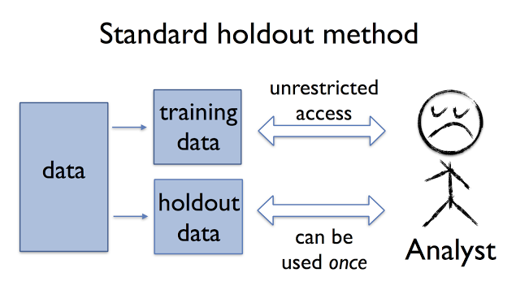
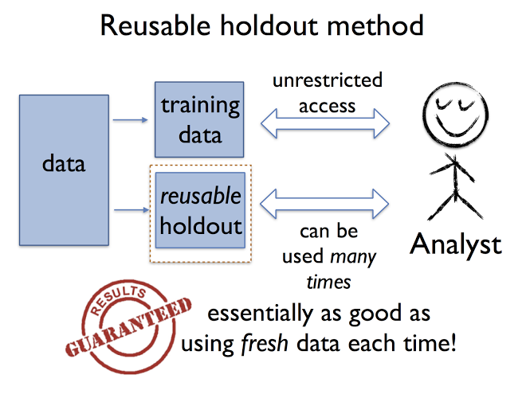

## Biomarker Signatures

<style type="text/css">
.definition {
  background-color: #E8F5FA;
  padding: 2px;
}
</style>

```{r setup, echo = FALSE}
library(knitr)
opts_chunk$set(fig.align = 'center', echo = FALSE)
```


```{r blocks, echo = FALSE, fig.width = 8, fig.height = 4, fig.align='center'}
library(rblocks)
df <- data.frame(matrix(rnorm(200), nrow = 10))
colnames(df) <- paste0("G", 1:20)
layout(matrix(c(1,2,3), 1, 3, byrow = TRUE), widths = c(.65, .1, .25))
par(mar = c(1, 1, 1, 1))

make_block(df, type = "data.frame")

plot(1 ~ 1, type="n", axes=FALSE, xlab="", ylab="")
arrows(.5, 1, 1.4, 1, lwd = 3)

df2 <- data.frame(Signature = rnorm(10))
make_block(df2)
```


> A **biomarker signature** is a transformation of multiple individual features to a one-dimensional space. 

- A signature that _reliably predicts_ an outcome may be useful for treatment selection or prognosis. 
- A signature that _discriminates_ between groups that would be treated differently may be clinically useful. 
- A signature may be continuous, binary, or take multiple discrete values. 


## Decisions, Decisions

- Do I include all features or a subset? 
    + Which subset? 
- How do I combine the features? 
    + Transformations?
    + Weight and combine with regression coefficients?
    + What coefficients? 
    + Thresholds/Cutoffs before or after combining? 
    
    
## Signature Development

Let $X$ denote the set of $p$ features. The signature is an unknown function 

$$
f(X): \mathbb{R}^p \mapsto \mathbb{R}^1
$$

- Development Phase Goals:
    + Estimate $f$ based on some _training data_
        - Based on association with outcome $Y$
        - ... interaction with treatment $Z$ and $Y$
        - ... "Natural" clusters
        - ... "Expert" knowledge
    + Provide a valid estimate of performance of the method in which $f$ is estimated
        - Depends on the true signal in the data
        - and the manner in which $f$ is estimated
    + Provide a specification of $f$ for others to use (optional)


## Valid estimates of performance

Let $S$ denote the development dataset, includes $X$ and possibly $Y, Z$ and other variables, a sample of size $n$ from distribution $\mathcal{P}$ with domain $\mathcal{X}$. 

Let $\mathcal{F}: \mathcal{X} \mapsto \mathcal{D}$ denote the process or algorithm that generates a particular $f$, i.e. $f \in \mathcal{F}$ 

Let $\phi_f: \mathcal{X} \mapsto \mathbb{R}$ denote the performance evaluation function, e.g., accuracy of predictive model, magnitude of hazard ratio. 

We are interested in estimating $E_\mathcal{P}[\phi_f(S)]$, the _generalization error_ for a fixed $f$ or maybe for a class $\mathcal{F}$.

An estimate of that is the in-sample empirical estimate: $\hat{E}[\phi_f(S)] = \frac{1}{n}\sum_{i=1}^n \phi_f(s_i)$. 

However, if the analyst __interacts with $S$__ in the definition of $\phi_f$, the estimate will be biased (overfit). I.e.,

$$
|E_\mathcal{P}[\phi_f(S)] - \hat{E}[\phi_f(S)]|
$$

will be large. 

## Traditional Remedies

1. Split-sample:
    - Partition $S$ into $S_t$ and $S_h$ with sample sizes $n_t$ and $n_h$
    - Hide $S_h$ from yourself
    - Generate an $f_t$ using $S_t$ only
    - Estimate is $E[\phi_{f_t}(S_h)]$
    - *Error for the fixed $f_t$*
2. Cross-validation:
    - Leave out sample $i$ and estimate $f$ using $S_{-i}$
    - Get single estimate $\phi_f(s_i)$
    - Repeat a number of times
    - Average the single estimates
    - *Generalization error for the class $\mathcal{F}$*
3. Bootstrapping:
    - Randomly sample $S_b$ from $S$, with replacement
    - Derive $f$ using $S_b$
    - Estimate using samples not selected $S_{-b}$
    - Repeat and average
    - *Generalization error for the class $\mathcal{F}$*

## Examples of "interacts with $S$"

1. Working on a genomic classifier for binary $Y$:
    + I test it out on $S$, and take a look at the individual-level accuracys $\phi(s_i)$ of a classifier $f(x_i)$
    + For $i$ where $\phi(s_i)$ is poor, manually change the value of $y_i$. 
2. Developing a predictor for binary $Y$:
    + Test the association of each $X_j$ with $Y$ using t-test on $S$. 
    + Select the 50 most significant
    + Put them all in a regression model and test on $S$
3. Developing a classfier
    + Select 50 most significant genes using $S$
    + Split $S$ into $S_h$ and $S_t$
    + Put them in a regression model estimated using $S_t$
    + Test it on $S_h$
4. Developing a classifier
    + Split into $S_t$ and $S_h$
    + Select 50 most significant using $S_t$
    + Fit regression model using $S_t$
    + Test it on $S_h$
5. Developing predictive signature
    + Split into $S_t$ and $S_h$
    + Build clustering model on $S_t$
    + Test performance on $S_h$
    + Performance isn't as good as I expected 
    + Go back to $S_t$ and try again using a different approach
    
    
**Which ones give valid estimates?**

## An analogy

Let's say I'm conducting a randomized clinical trial testing a new treatment versus a placebo. 

- I measure OS, EFS, pCR, DFS, and some PK biomarker
- At the end, test them all and report the most significant difference

- Evaluating $\phi$ using $S$ while also using $S$ to define $\phi$
- "Adaptive data analysis"

**Obviously** not OK. In clinical trials we have pre-registration. 




## A New Hope?



C Dwork, et al. (2015) The reusable holdout: Preserving validity in adaptive data analysis. _Science_, 349(6248):636--8. 
http://googleresearch.blogspot.com/2015/08/the-reusable-holdout-preserving.html

## Outline

1. Overview and theory
2. The approach
3. Does it work? 
4. Is it useful? 

## Overview


The values and standards of biomarker researchers clash with the traditional approach to preserving validity

The reusable holdout is

- A mechanism to allow analysts to obtain information from the holdout set
    + Controlling the maximum amount of information leaked
    + Through a **differentially private** mechanism
    + "Neutralizes the risk of overfitting"
- A general approach
    + Specific implementations depend on the performance criteria $\phi$
    + Depends on specification of an "overfitting budget", and some tuning parameters


## Differential Privacy

> Suppose you have access to a database that allows you to compute the total incidence of cancer in a certain group of people. If you knew that Mr. White was going to leave the group, simply querying this database before and after his departure would allow you to deduce his cancer status.

To preserve the privacy of individuals' data in the database, we can introduce a randomized algorithm $\mathcal{A}$. Thus, instead of the query releasing $S$, it releases $\mathcal{A}(S)$. 

### Differential privacy {.definition}
A randomized algorithm $\mathcal{A}$ with domain $\mathcal{X}^n$ for $n > 0$ is *differentially private* if for all pairs of datasets that differ in a single element, $S, S'$, and $\epsilon > 0$

$$
\max_{x \in \mathcal{X}} \frac{P[\mathcal{A}(S) \in x]}{P[\mathcal{A}(S') \in x]} \leq e^\epsilon
$$


## Properties

- Differential privacy is preserved under adaptive composition
    + Handles adaptive data analysis
- Implies bounds on overfitting: 

If $\mathcal{A}$ is a differentially private algorithm from $\mathcal{X} \mapsto \mathbb{R}$ (i.e., like a random version of $\phi$), then for $n \geq 2/\epsilon^2$, 

$$
P(|E_\mathcal{P}(\phi) - E_S(\phi)| > 13 \epsilon) \leq \log\left(\frac{2}{\epsilon}\right),
$$

where $\phi = \mathcal{A}(S)$.


### To Do:

1. Develop a differentially private algorithm
2. Fix $n$ or $\epsilon$
3. Profit!


## Thresholdout

Training set $S_t$, holdout set $S_h$, threshold $T$, tolerance $\tau$, and budget $B$.

Set $\hat{T} = T + \gamma$ where $\gamma \sim N(0, 4\tau)$. For $\phi: \mathcal{X} \rightarrow \mathbb{R}$: 

1. If $B < 1$, stop. 
2. Else, sample $\xi \sim N(0, 2\tau)$, $\gamma \sim N(0, 4\tau)$, and $\eta \sim N(0, 8\tau)$. 
    1. If $|E[\phi_f(S_h)] - E[\phi_f(S_t)]| > \hat{T} + \eta$, output $E[\phi_f(S_h)] + \xi$ and set $B = B - 1$ and $\hat{T} = T + \gamma$. 
    2. Else, output $E[\phi_f(S_t)]$. 
    
    
## Comments: 

- $T$ and $\tau$ control the degree of generalization error: 
    $$
    P\left\{|E_\mathcal{P}[\phi_f(S)] - \hat{E}[\phi_f(S)]| > \tau\right\} \leq 6 e^{-\tau^2 n}
    $$
- Dwork et al. recommend choosing so $T + \tau = 0.05$
- Setting budget $B$ equal to
    $$
    \tau^2 n
    $$
  guarantees that the above bound is met.
- Note that the bound depends on $n$. 

```{r bugd, echo = FALSE, fig.align = "center"}
library(ggplot2)
plotbud <- function(n, tau){
  
  tau^2 * n
  
}

ggplot(data.frame(n = c(0, 2000)), aes(x = n)) + 
  stat_function(fun = plotbud, args = list(tau = .025), aes(color = "0.025"), lwd = 2) + 
  stat_function(fun = plotbud, args = list(tau = .05), aes(color = "0.05"), lwd =2 ) + 
  stat_function(fun = plotbud, args = list(tau = .1), aes(color = "0.1"), lwd = 2) + 
  scale_y_continuous("Budget") + scale_color_manual("tau", breaks = c("0.025", "0.05", "0.1"), values = c("blue", "lightblue", "aliceblue"))
```

## Numerical experiment

Data setup, repeat for training $S_t$, holdout $S_h$, and validation $S_v$ sets:

1. Outcome $Y_{i} \sim N(0, 1)$ for $i = 1, \ldots, n$
2. Features $X_{ij} \sim N(0, 1)$ for $i = 1, \ldots, n$, $j = 1, \ldots, d$
3. For $j = 1, \ldots, K$ features, $X_{ij} = X_{ij} + c\cdot Y_i$

Feature selection:

- Compute correlations $\rho_j$ between $Y$ and $X_j$ for all $j$ on $S_t$ and $\rho^*_j$ on $S_h$
    1. **Strict**: Select $k$ features with largest $|\rho_j|$
    2. **Adaptive**: Select $k$ features with largest $|\rho_j|$ *and* $\mbox{sign}(\rho_j) = \mbox{sign}(\rho^*_j)$
    3. **Thresholdout**: 
          - Compute $\theta_j = |\rho_j - \rho^*_j|$. 
          - If $\theta_j > \hat{T} + \eta$, set $\hat{\rho}_j = \rho^*_j + \xi$, else $\hat{\rho}_j = \rho_j$
          - Select $k$ features with largest $|\hat{\rho}_j|$ *and* $\mbox{sign}(\rho_j) = \mbox{sign}(\hat{\rho}_j)$
    
Signature: 

1. Fit linear regression model with selected features. 
2. $\phi: \mathcal{X} \mapsto \mathbb{R}^+$ = Root mean squared error: $\sqrt{\frac{1}{n}\sum_{i=1}^n(\hat{Y_i} - Y_i)^2}$


For comparison purposes:

1. Fit penalized linear regression model using \texttt{glmnet} on $S_t$ only
    - Selecting $\lambda$ using cross-validation
    - Using strictly selected features


## Results: The problem

### Null scenario, no features associated with $Y$

```{r werk, echo = FALSE}
load("nosignal-result.RData")
load("highsignal-result.RData")

nmes <- c("Features", "Adaptive - Training", "Adaptive - Holdout", "Adaptive - Test", 
          "Thresholdout - Holdout", "Strict - Holdout", "Thresholdout - Test", 
          "Lasso - Training", "Lasso - Test")

colnames(nosignal$mean) <- colnames(nosignal$sd) <- nmes
colnames(highsignal$mean) <- colnames(highsignal$sd) <- nmes

library(ggplot2)
library(reshape2)

plotme <- function(nosignal, dex){

  dex <- c(1, dex)
  nosigsum <- merge(melt(nosignal$mean[, dex], id.vars = "Features"),
    melt(as.data.frame(nosignal$sd[, dex]), id.vars = "Features"),
    by = c("Features", "variable"))

    colnames(nosigsum) <- c("krange", "setting", "error", "sd")

    ggplot(nosigsum, aes(x = krange, y = error, ymin = error - sd, ymax = error + sd,
                         shape = setting, color = setting, fill = setting)) +
      geom_point() + geom_line() + geom_ribbon(color = NA, alpha = .2) +
      scale_color_brewer(type = "qual", palette = 2) + scale_fill_brewer(type = "qual", palette = 2)

}


plotme(nosignal, c(2, 3, 4))
```


## Results: Does it work?

```{r wekg2, echo = FALSE}
plotme(nosignal, 2:5)
```

## Results: Does it work?

```{r wekg3}
plotme(nosignal, c(4, 6, 7))
```


## Results

### Signal: 50 features associated with $Y$
### Performance on holdout

```{r holdres}
plotme(highsignal, c(3, 5, 6))
```

## Results: Is it useful?

### Signal: 50 features associated with $Y$
### Performance on Independent test dataset

```{r usef}
plotme(highsignal, c(4, 7))
plotme(highsignal, c(6, 7))
plotme(highsignal, c(9, 7))
```


## Conclusions

### Should people use Thresholdout?

- Still relying on researchers to develop and validate their own models
- Incentive for objective assessment? 
- We have no control over the holdout datasets
- You need to plan this in advance, i.e., can't fix example 5.

### Is it useful? 

- Benefits are not clear, i.e., may not produce better performing algorithms
- Future work, expect better performing adaptive procedures to be developed
- Need to make good use of information obtained from holdout to outperform standard methods
- The budget may not be large enough for many cancer studies (see slide 15)

*Slides and code available at http://sachsmc.github.io/reusable-holdout*
